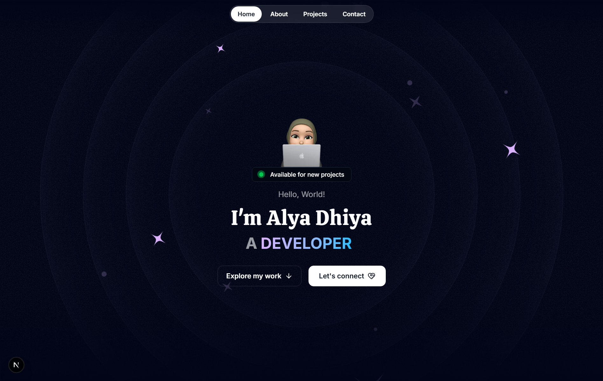

# 🌐 My Portfolio

Welcome to my personal portfolio!  
This website showcases my projects, skills, and experiences. It’s built with modern web technologies and deployed via **GitHub Pages**.

🔗 **Live Demo**: [alyadyh.github.io](https://alyadyh.github.io)

---

## 📌 About

This portfolio is designed to:

- Highlight my **projects** and contributions.
- Share my **skills** and tech stack.
- Serve as my **digital resume**.

---

## 🚀 Features

- 🖥️ Responsive design for desktop & mobile
- 🎨 Modern UI/UX
- ⚡ Fast and lightweight
- 📂 Project showcase with links
- 📬 Contact section

---

## 🛠️ Tech Stack

- **Frontend**: Next.js / HTML / CSS / TypeScript
- **Styling**: Tailwind CSS
- **Deployment**: GitHub Pages

---

## 📸 Preview

---
